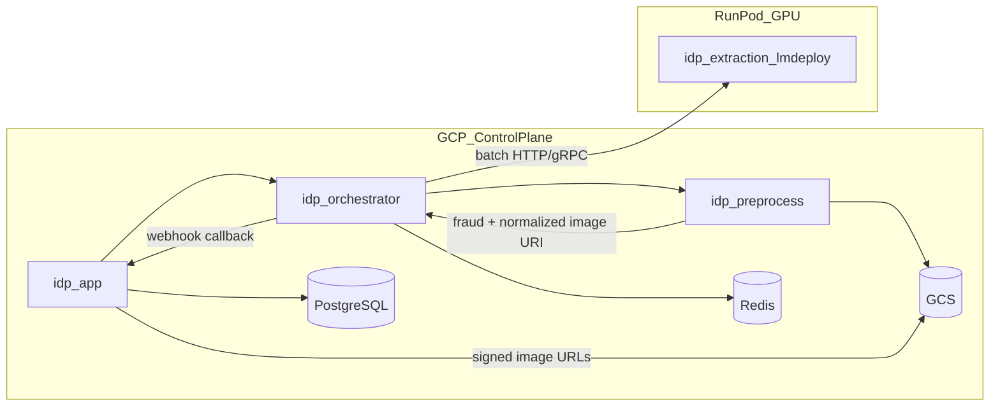
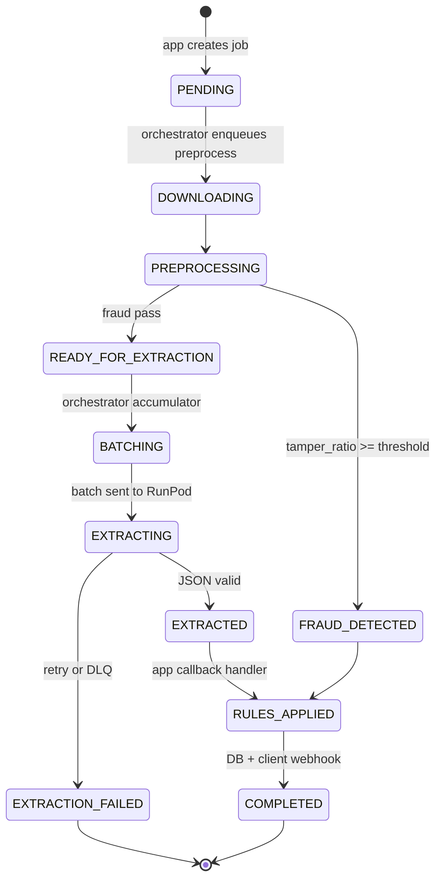
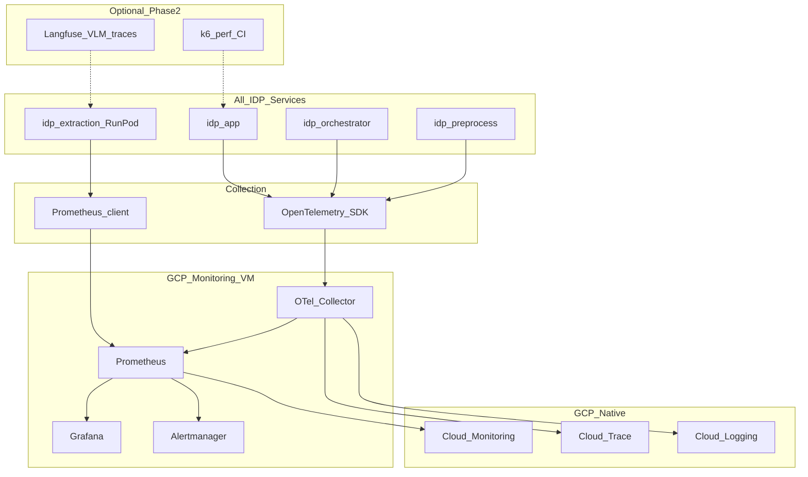

# Production IDP System Plan (Invoice Extraction)

## Context and constraints

The repo is currently **greenfield**: only reference notebooks exist under [`references/`](references/).

| Reference | What it gives the architecture |
|-----------|--------------------------------|
| [`references/doctamper_mix_transformer_unet_real_receipt.py`](references/doctamper_mix_transformer_unet_real_receipt.py) | MiT-B2 + U-Net (`segmentation_models_pytorch`), **full-resolution** inference, image-level label via `tamper_ratio >= TAMPER_PIXEL_THRESHOLD` (default `0.0001`), outputs mask + overlay artifacts |
| [`references/intern_vl3_6_8b_metric.py`](references/intern_vl3_6_8b_metric.py) | **Batch size 48** is throughput-optimal on A100 80GB (~472 tok/s, ~2.02 req/s); BS 64 slightly regresses — orchestrator must **micro-batch** with max size **48** and a **max wait** (e.g. 200–800 ms) |

**Deployment choice (from you):**
- **GCP** for storage (GCS), smaller services on **VM + Docker** (or Cloud Run where stateless fits).
- **RunPod** for **extraction only** (lmdeploy + InternVL), isolated so GPU can be **stopped when idle**.

---

## Target architecture



### Service responsibilities

| Service | Role | Runtime |
|---------|------|---------|
| **idp-app** | Public API, tenant auth, job creation, **dynamic post-extraction rules**, DB read/write, customer **callbacks** | GCP VM Docker or Cloud Run |
| **idp-orchestrator** | Job state machine, **batch accumulator**, circuit breaker, RunPod lifecycle hooks, retry/DLQ | GCP VM Docker (always-on) |
| **idp-preprocess** | **Parallel URL download** (GCS/S3/http), image normalize, **DocTamper** fraud, write artifacts to GCS | GCP VM Docker + GPU optional (T4/L4 sufficient) |
| **idp-extraction** | lmdeploy OpenAI-compatible (or custom) API, **batched VLM** inference, structured JSON schema output | **RunPod** pod template |

**Fraud short-circuit:** If `predicted_tampered == true`, orchestrator marks job `FRAUD_DETECTED`, skips RunPod, app applies fraud rules and notifies client (saves GPU cost).

---

## Recommended technology stack

| Concern | Choice | Rationale |
|---------|--------|-----------|
| Inter-service async | **Redis Streams** (phase 1) → **Pub/Sub or Kafka** (phase 2 scale) | Redis already needed for batching; lower ops than Kafka early |
| Batch state / circuit breaker | **Redis** | Sliding-window failure counts, batch queue keys, RunPod “warm” flag |
| Durable jobs + rules | **PostgreSQL** (Cloud SQL) | ACID for job lineage, prompt versions, rule definitions |
| Blobs | **GCS** | Native GCP; store downloaded originals, normalized JPEG/WebP, fraud masks |
| HTTP APIs | **FastAPI** + **Pydantic v2** | Aligns with Python ML stack |
| Contracts | **OpenAPI 3.1** + generated TS/Python clients in `packages/idp-contracts` | Versioned APIs across 4 services |
| GPU serving | **lmdeploy** on RunPod | Your chosen stack; expose `/v1/chat/completions` or dedicated batch endpoint |
| Performance monitoring | **Prometheus + Grafana** (primary), **OpenTelemetry**, optional **Langfuse** for VLM traces | See [Performance monitoring stack](#performance-monitoring-stack) |
| Logs / traces | **OpenTelemetry** → **Cloud Logging** + **Cloud Trace** (GCP native) | Correlate `job_id` across 4 services |
| IaC | **Terraform** (`deploy/terraform/gcp`) + **Docker Compose** (`deploy/docker`) + RunPod **template JSON** | Reproducible GCP + ephemeral GPU |
| Secrets | **GCP Secret Manager** | GCS SA keys, RunPod API key, DB URL |
| Rules engine (app) | **JSON Logic** or **CEL** stored in DB, hot-reloaded | Change rules without redeploy |

**Not recommended early:** Celery as the core orchestrator (GPU batching and RunPod lifecycle fit a **dedicated orchestrator service** better). Use **async workers inside preprocess** (httpx + asyncio semaphore) for URL fetch parallelism.

---

## Production repository layout

```
nexts-system-idp-service/
├── docs/
│   ├── architecture.md
│   ├── api/
│   └── runbooks/
├── references/                    # keep Colab exports (read-only)
├── packages/
│   ├── idp-contracts/           # OpenAPI, shared DTOs, error codes
│   └── idp-common/                # GCS client, logging, OTel, redis, health
├── services/
│   ├── idp-app/
│   ├── idp-orchestrator/
│   ├── idp-preprocess/
│   │   └── models/doctamper/      # MiT-UNet loader (port from reference)
│   └── idp-extraction/            # thin client + RunPod bootstrap scripts
├── deploy/
│   ├── docker/                    # compose for local + VM
│   ├── terraform/gcp/             # VPC, Cloud SQL, Redis, GCS, IAM, VMs
│   └── runpod/                    # pod template, lmdeploy start script
├── infra/
│   └── monitoring/
│       ├── prometheus/            # scrape configs, recording rules
│       ├── grafana/dashboards/    # IDP pipeline, GPU, SLO boards
│       ├── otel-collector/        # receivers + exporters
│       └── alerts/                # Alertmanager or GCP alerting policies
└── scripts/
    ├── seed_prompts.sql
    └── smoke_e2e.sh
```

Each service: `src/`, `tests/`, `Dockerfile`, `pyproject.toml`, `.env.example`.

---

## End-to-end job lifecycle



### 1) App service (`idp-app`)

**APIs (examples):**
- `POST /v1/jobs` — `{ image_urls[], invoice_type?, prompt_profile_id?, callback_url?, metadata }`
- `GET /v1/jobs/{id}` — status + partial results
- `POST /v1/rules` / `PATCH /v1/rules/{id}` — dynamic rule CRUD (JSON Logic payload)
- `POST /v1/prompt-profiles` — versioned prompts per invoice context

**On completion (internal webhook from orchestrator):**
1. Load extraction JSON + fraud payload from GCS/DB.
2. Evaluate **ordered rules** (e.g. required fields, total amount tolerance, VAT format, block if fraud).
3. Persist `job_results`, `line_items`, `audit_log`.
4. `POST` customer `callback_url` with HMAC signature.

### 2) Preprocess service (`idp-preprocess`)

Port core logic from reference:

```python
# From references/doctamper_... — production wrapper
infer_single_image(path) -> tamper_ratio, mask_uri, predicted_tampered
```

**URL batch download:**
- Input: list of signed/public URLs (GCS `gs://` resolved via SA, S3 via optional adapter).
- **asyncio** + `httpx` with `MAX_CONCURRENT_DOWNLOADS` (e.g. 32), size cap (e.g. 20 MB), MIME sniff, timeout.
- Normalize: EXIF strip, max edge cap (configurable, e.g. 4096) to control VLM cost while preserving readability.
- Upload to GCS: `jobs/{job_id}/original.jpg`, `normalized.jpg`, `fraud_mask.png`.

**Consumer:** Redis Stream `preprocess.tasks` → ack on success.

### 3) Orchestrator service (`idp-orchestrator`)

**Batch accumulator (critical for InternVL throughput):**
- Parameters: `BATCH_MAX_SIZE=48`, `BATCH_MAX_WAIT_MS=500`, `BATCH_MIN_SIZE=1` (flush on timeout).
- Key: `batch:ready:{invoice_type}` or single queue if prompts identical.
- On flush: call RunPod extraction with array of `{ job_id, gcs_uri, prompt, response_schema }`.

**Circuit breaker (RunPod):**
- States: `CLOSED` → `OPEN` after N failures / timeout → `HALF_OPEN` probe.
- When `OPEN`: stop flush, queue jobs in Redis, optionally trigger **RunPod start** webhook (if you automate pod wake).
- Track: p95 latency, 5xx rate, GPU OOM errors.

**RunPod integration:**
- Health: `GET /health` on extraction endpoint before batch send.
- Auth: API key header from Secret Manager.
- **Cold start:** jobs stay `BATCHING` with visibility timeout; orchestrator retries with backoff.
- **Cost control:** scale-to-zero policy documented in runbook; orchestrator exposes admin `POST /internal/runpod/warm`.

### 4) Extraction service (RunPod + lmdeploy)

**Model:** `OpenGVLab/InternVL3_5-8B-Flash` via lmdeploy.

**Batch inference contract:**
- Prefer **single request with N images** (match lmdeploy continuous batching) aligned to your BS=48 benchmark.
- Enforce **JSON schema** / regex repair pass for line items (mitigate FP/FN from reference confusion matrix — TP 2084, FN 396 suggests recall tuning via prompt + schema).

**Prompt management:**
- Store templates in PostgreSQL: `prompt_profiles(id, version, invoice_type, system_prompt, user_template, json_schema)`.
- Orchestrator passes `prompt_profile_id`; extraction service resolves or receives expanded prompt (cache in Redis).

**Suggested prompt variables:** `invoice_type`, `locale`, `currency`, `line_item_fields[]`, few-shot examples optional.

---

## Data model (PostgreSQL sketch)

| Table | Purpose |
|-------|---------|
| `jobs` | id, tenant_id, status, image_urls jsonb, prompt_profile_id, callback_url, created_at |
| `job_stages` | job_id, stage, started_at, ended_at, error_code, metadata |
| `job_artifacts` | job_id, type (original, normalized, mask), gcs_uri |
| `extraction_results` | job_id, raw_json, validated_json, model_version, batch_id |
| `fraud_results` | job_id, tamper_ratio, predicted_tampered, mask_uri |
| `prompt_profiles` | versioned prompts + schema |
| `rules` | tenant_id, priority, condition_json, action_json, enabled |
| `outbox_callbacks` | reliable customer webhook delivery |

---

## Infrastructure as Code (GCP + RunPod)

### Terraform modules (`deploy/terraform/gcp/`)

1. **network** — VPC, firewall (orchestrator ↔ preprocess only on private net).
2. **storage** — GCS bucket `idp-artifacts-{env}`, lifecycle (e.g. 90d), CMEK optional.
3. **database** — Cloud SQL Postgres (HA prod).
4. **cache** — Memorystore Redis.
5. **compute** — 1–2 GCE VMs (e.g. `e2-standard-4`) with cloud-init pulling Docker Compose; or MIG for orchestrator/preprocess.
6. **iam** — SA per service: `app` (DB), `preprocess` (GCS write), `orchestrator` (GCS read, invoke RunPod).
7. **secrets** — Secret Manager entries.
8. **observability** — log sinks, uptime checks on app + orchestrator.

### RunPod (`deploy/runpod/`)

- Pod template: CUDA image, lmdeploy install, model weights volume or HF cache.
- Start script: launch API on port 8000, register health.
- **Network:** RunPod public endpoint + **IP allowlist** or Cloudflare tunnel from GCP orchestrator only.

### Local dev (`deploy/docker/docker-compose.yml`)

- Postgres, Redis, MinIO (GCS mock), all four services; extraction mocked or pointed at dev RunPod.

---

## Cross-cutting concerns

### Image URL security
- App validates URL host allowlist (GCS buckets per tenant).
- Prefer **signed URLs** generated by app (short TTL) rather than passing raw private paths to preprocess.
- Preprocess never logs full signed query strings.

### Idempotency and delivery
- `Idempotency-Key` on `POST /v1/jobs`.
- Redis Stream consumer groups with **XAUTOCLAIM** for stuck messages.
- Callback **outbox pattern** in app (retry with exponential backoff).

### Quality and operations
- Golden-set regression job (nightly): fraud + extraction vs labeled receipts.
- SLO example: p95 end-to-end &lt; 30s when RunPod warm, &lt; 120s cold.

---

## Performance monitoring stack

Goal: one place to see **pipeline throughput**, **per-stage latency**, **GPU/VLM efficiency** (aligned with your InternVL benchmark in [`references/intern_vl3_6_8b_metric.py`](references/intern_vl3_6_8b_metric.py)), and **business-quality proxies** (schema validation, fraud rate).

### Recommended stack (phased)



| Layer | Tool | Role for IDP |
|-------|------|----------------|
| **Metrics (primary)** | **Prometheus** + **Grafana** (self-hosted on GCP VM, or **Grafana Cloud** free tier) | Custom counters/histograms: batch size, stage latency, tok/s, fraud %, queue depth |
| **Instrumentation** | **OpenTelemetry** (Python: `opentelemetry-instrumentation-fastapi`) | Distributed traces with `job_id` / `tenant_id`; export metrics to Prometheus via Collector |
| **Collector** | **OpenTelemetry Collector** (`infra/monitoring/otel-collector/`) | Single agent on monitoring VM: receive OTLP, fan-out to Prometheus + Cloud Trace |
| **GCP native** | **Cloud Monitoring** + **Cloud Trace** + **Cloud Logging** | VM/Redis/Cloud SQL metrics, uptime checks, log-based metrics; backup if Grafana down |
| **GPU (RunPod)** | **NVIDIA DCGM Exporter** (if GPU pod allows) + **lmdeploy** request logs | GPU util, VRAM, temperature; map to your A100 throughput baseline |
| **RunPod ephemeral** | **Prometheus Pushgateway** or **remote_write** to GCP Prometheus/Mimir | RunPod pod pushes metrics before shutdown; avoids lost scrape targets |
| **VLM / prompt debugging** | **Langfuse** (self-hosted or cloud) — *optional phase 2* | Per-request prompt hash, latency, token in/out, model version; links to `prompt_profile_id` |
| **Model quality drift** | **Evidently** or **WhyLabs** — *optional* | Compare extraction field distributions vs golden set over time |
| **Load / regression** | **k6** or **Locust** in CI (`scripts/perf/`) | Nightly synthetic jobs; alert if p95 E2E or `tokens_per_sec` drops &gt;15% vs baseline |
| **Error tracking** | **Sentry** (optional) | FastAPI exceptions, RunPod 5xx bursts |

**Primary recommendation:** Start with **Prometheus + Grafana + OpenTelemetry** on one small GCP VM (same Docker Compose as dev). Add **Langfuse** only when tuning prompts; add **Evidently** when you have enough production labels.

### IDP-specific metrics (instrument in `packages/idp-common/metrics.py`)

All services expose `/metrics` (Prometheus format). Use consistent labels: `service`, `env`, `tenant_id` (low cardinality buckets), `invoice_type`, `prompt_profile_version`.

| Metric | Type | Service | Use |
|--------|------|---------|-----|
| `idp_jobs_total` | Counter | app, orchestrator | By `status` (completed, fraud, failed) |
| `idp_stage_duration_seconds` | Histogram | all | Stages: `download`, `preprocess`, `fraud`, `batch_wait`, `extract`, `rules`, `callback` |
| `idp_batch_size` | Histogram | orchestrator | Compare distribution to target **48** |
| `idp_batch_wait_seconds` | Histogram | orchestrator | Tune `BATCH_MAX_WAIT_MS` |
| `idp_batch_utilization_ratio` | Gauge | orchestrator | `last_batch_size / 48` — key efficiency KPI |
| `idp_extraction_tokens_total` | Counter | extraction | Input + output tokens per batch |
| `idp_extraction_tokens_per_second` | Gauge | extraction | **Direct comparison** to InternVL benchmark (~472 @ BS=48) |
| `idp_extraction_requests_per_second` | Gauge | extraction | Target ~2.02 req/s @ BS=48 on A100 |
| `idp_runpod_warm` | Gauge | orchestrator | 0/1 — explains latency spikes |
| `idp_circuit_breaker_state` | Gauge | orchestrator | CLOSED=0, OPEN=1, HALF_OPEN=2 |
| `idp_fraud_detected_total` | Counter | preprocess | Tamper blocks (cost saved) |
| `idp_fraud_tamper_ratio` | Histogram | preprocess | Distribution near threshold |
| `idp_download_duration_seconds` | Histogram | preprocess | Per URL; flag slow GCS |
| `idp_download_failures_total` | Counter | preprocess | By error class |
| `idp_schema_validation_failures_total` | Counter | extraction, app | Proxy for extraction FN |
| `idp_redis_stream_lag` | Gauge | orchestrator | Consumer group pending count |
| `idp_callback_delivery_total` | Counter | app | success / retry / dead |

**Recording rules (Prometheus)** — pre-aggregate in `infra/monitoring/prometheus/rules.yml`:
- `idp:e2e_latency:p95` — job created → completed
- `idp:extraction_throughput:5m` — rate of tokens / wall time
- `idp:batch_efficiency:1h` — avg batch size / 48

### Grafana dashboards (commit JSON under `infra/monitoring/grafana/dashboards/`)

1. **IDP Pipeline Overview** — jobs/min, E2E p50/p95/p99, error rate, queue lag.
2. **Batch & GPU Efficiency** — batch size histogram, utilization %, tok/s vs baseline line (472), RunPod warm/cold.
3. **Preprocess & Fraud** — download p95, fraud rate, tamper_ratio distribution.
4. **Extraction Quality** — schema failures, JSON repair rate, tokens per job.
5. **SLO & Cost** — % jobs under 30s (warm), fraud short-circuit savings (jobs skipped RunPod), RunPod uptime hours.

### Alerts (Alertmanager → Slack/email; mirror critical rules in Cloud Monitoring)

| Alert | Condition | Action |
|-------|-----------|--------|
| `ExtractionThroughputDegraded` | `tokens_per_sec` &lt; 80% of baseline for 10m | Check RunPod GPU, batch size, lmdeploy OOM |
| `BatchUnderfilled` | avg batch size &lt; 16 for 1h while queue &gt; 100 | Increase `BATCH_MAX_WAIT_MS` or traffic |
| `RunPodCircuitOpen` | breaker OPEN &gt; 5m | Wake pod, check endpoint |
| `HighFraudRate` | fraud &gt; X% vs 7d avg | Investigate attack or threshold drift |
| `E2ELatencySLO` | p95 E2E &gt; 30s (warm) for 15m | Trace slow stage via Cloud Trace |
| `RedisStreamBacklog` | lag &gt; threshold | Scale preprocess workers |

### RunPod + lmdeploy monitoring details

- **lmdeploy:** enable request logging; parse `prompt_tokens`, `completion_tokens`, `total_time` per batch response into Prometheus counters.
- **DCGM** (when available on pod): scrape `DCGM_FI_DEV_GPU_UTIL`, `DCGM_FI_DEV_FB_USED` — correlate with tok/s drops.
- **Cold start:** orchestrator increments `idp_runpod_cold_start_total`; dashboard overlay on E2E latency.
- **Benchmark regression:** store InternVL table (BS 1–64) in `docs/performance/baseline.json`; CI fails if nightly load test deviates &gt;15% from BS=48 reference.

### Terraform addition (`deploy/terraform/gcp/modules/observability/`)

- Small GCE VM or existing VM: Docker Compose for Prometheus, Grafana, OTel Collector, Alertmanager.
- Firewall: scrape targets on private VPC only; Grafana behind IAP or VPN.
- Cloud Monitoring **notification channels** + **alert policies** for VM disk, Redis memory, Cloud SQL connections.
- Optional: GCS bucket for long-term Prometheus data (**Mimir** or **Thanos** only if retention &gt; 30d needed).

### Repo additions for monitoring

```
infra/monitoring/
├── prometheus/prometheus.yml
├── prometheus/rules/idp_recording.yml
├── grafana/dashboards/*.json
├── grafana/provisioning/
├── otel-collector/config.yaml
├── alertmanager/alertmanager.yml
└── README.md              # how to run locally + prod

scripts/perf/
├── k6_create_jobs.js
├── baseline_compare.py    # vs intern_vl3_6_8b_metric baseline
└── README.md

packages/idp-common/
└── src/idp_common/metrics.py
└── src/idp_common/tracing.py
```

### What to skip early

- Full **ELK** stack — Cloud Logging is enough with structured JSON logs (`job_id` field).
- **Datadog** — viable but costly; only if team already standardized on it.
- **Kafka + Burrow** — not needed until phase-2 Kafka migration.

---

## Implementation phases

### Phase 0 — Foundation (week 1–2)
- Monorepo scaffold, `idp-contracts` OpenAPI, shared `idp-common` (GCS, Redis, logging, **metrics + tracing**).
- Docker Compose local stack **including Prometheus + Grafana + OTel Collector**; Terraform dev environment (GCS + Redis + Cloud SQL small).
- DB migrations + job state enum.
- Baseline file `docs/performance/baseline.json` from InternVL reference metrics.

### Phase 1 — Preprocess + fraud (week 2–3)
- Port DocTamper loader from [`references/doctamper_mix_transformer_unet_real_receipt.py`](references/doctamper_mix_transformer_unet_real_receipt.py) into `idp-preprocess` (configurable checkpoint from GCS).
- Async URL downloader + GCS upload.
- Redis Stream worker; unit tests with fixture images.

### Phase 2 — App + orchestrator skeleton (week 3–4)
- App: create job API, DB persistence, internal completion webhook stub.
- Orchestrator: state machine, preprocess enqueue, fraud short-circuit path.

### Phase 3 — RunPod extraction + batching (week 4–6)
- RunPod template + lmdeploy InternVL deployment.
- Batch accumulator (BS=48, wait window tunable).
- Circuit breaker + retry/DLQ.
- Structured JSON output validation.

### Phase 4 — Dynamic rules + production hardening (week 6–8)
- Rules CRUD + JSON Logic evaluation on extraction result.
- Customer callbacks + outbox.
- Prompt profile versioning admin API.
- Terraform prod **observability module**, Grafana dashboards, Alertmanager policies, runbooks.
- **k6 nightly perf job** + golden-set quality job; optional Langfuse for prompt tuning.

---

## Key defaults to codify in config

| Parameter | Suggested value | Source |
|-----------|-----------------|--------|
| `BATCH_MAX_SIZE` | 48 | InternVL A100 benchmark |
| `BATCH_MAX_WAIT_MS` | 300–800 | Trade latency vs throughput |
| `TAMPER_PIXEL_THRESHOLD` | 0.0001 (tunable per env) | DocTamper reference |
| `MAX_CONCURRENT_DOWNLOADS` | 32 | URL batch throughput |
| `RUNPOD_IDLE_SHUTDOWN` | policy in runbook | Cost control |

---

## Risks and mitigations

| Risk | Mitigation |
|------|------------|
| RunPod cold start | Queue + warm probe; optional scheduled warm before business hours |
| Very large receipt images | Preprocess max dimension + VLM tile strategy if needed later |
| Prompt drift hurts extraction FN | Versioned `prompt_profiles`, A/B flag per tenant, golden-set CI |
| Single orchestrator SPOF | Redis persistence; second orchestrator instance with consumer group competition |
| GCS egress cost | Store normalized once; pass URIs not bytes between services |

---

## Deliverable for this planning step

After approval, first implementation artifact should be:
1. [`docs/architecture.md`](docs/architecture.md) — English copy of this plan + sequence diagrams.
2. Repo scaffold + `docker-compose` + Terraform `dev` module skeleton.
3. OpenAPI for `POST /v1/jobs` and internal orchestrator ↔ preprocess/extraction messages.

No code changes until you confirm the plan.
