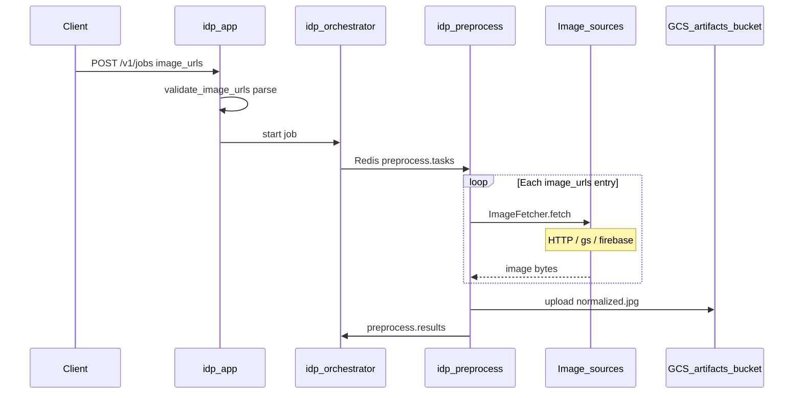

# Nguồn hình ảnh (Image datasources)

Tài liệu mô tả các định dạng URL/path được hỗ trợ khi tạo job (`POST /v1/jobs` → `image_urls[]`) và cách preprocess tải ảnh.

## Luồng hiện tại



**Lưu ý:** Ảnh **đầu vào** có thể từ Firebase/GCS/HTTP bất kỳ; ảnh **đã xử lý** (normalized, mask) luôn ghi vào bucket artifact IDP (`GCS_BUCKET` / MinIO local) dưới `jobs/{job_id}/`.

---

## Định dạng `image_urls` được hỗ trợ

| Loại | Ví dụ | Cách tải |
|------|-------|----------|
| **HTTP(S)** | `https://cdn.example.com/receipt.jpg` | `httpx` GET |
| **GCS** | `gs://bucket/path/to/image.jpg` | `google-cloud-storage` |
| **Firebase (scheme)** | `firebase://my-project.appspot.com/folder/img.jpg` | GCS API (cùng bucket Firebase) |
| **Firebase (download URL)** | `https://firebasestorage.googleapis.com/v0/b/.../o/...?alt=media&token=...` | Ưu tiên GCS API; fallback HTTP nếu không có quyền |
| **GCS HTTPS** | `https://storage.googleapis.com/bucket/object` | GCS API (parse bucket/path) |

Parser: [`packages/idp-common/src/idp_common/storage_uri.py`](../packages/idp-common/src/idp_common/storage_uri.py)  
Fetcher: [`packages/idp-common/src/idp_common/image_fetcher.py`](../packages/idp-common/src/idp_common/image_fetcher.py)

---

## Firebase Storage — cấu hình production

Firebase Storage **dùng GCS bucket** phía sau. Preprocess cần **service account** có quyền đọc bucket chứa ảnh hóa đơn.

### 1. Service account

- Tạo SA trên GCP (cùng project Firebase) hoặc dùng Firebase Admin SDK credentials.
- Role tối thiểu trên bucket ảnh đầu vào: `roles/storage.objectViewer`.
- Mount JSON: `GOOGLE_APPLICATION_CREDENTIALS=/secrets/firebase-sa.json`

### 2. Biến môi trường (`idp-preprocess`)

| Biến | Mô tả |
|------|--------|
| `FIREBASE_PROJECT_ID` | GCP project ID (Firebase project) |
| `FIREBASE_ALLOWED_BUCKETS` | Allowlist bucket, phân tách dấu phẩy (khuyến nghị prod) |
| `ALLOWED_IMAGE_HOSTS` | Allowlist host HTTPS (tùy chọn), ví dụ `firebasestorage.googleapis.com` |
| `GCS_BUCKET` | Bucket **artifact** IDP (upload sau preprocess), khác bucket ảnh đầu vào |

Ví dụ:

```bash
FIREBASE_PROJECT_ID=my-firebase-project
FIREBASE_ALLOWED_BUCKETS=my-project.appspot.com,my-project.firebasestorage.app
ALLOWED_IMAGE_HOSTS=firebasestorage.googleapis.com,storage.googleapis.com
GCS_BUCKET=idp-prod-artifacts
GOOGLE_APPLICATION_CREDENTIALS=/run/secrets/gcp-sa.json
```

### 3. Cách client gửi ảnh

**Khuyến nghị (ổn định, không hết token):**

```json
{
  "image_urls": [
    "firebase://my-project.appspot.com/tenants/t1/invoices/abc.jpg"
  ]
}
```

hoặc

```json
{
  "image_urls": [
    "gs://my-project.appspot.com/tenants/t1/invoices/abc.jpg"
  ]
}
```

**Download URL từ Firebase SDK (Web/Mobile):**

```json
{
  "image_urls": [
    "https://firebasestorage.googleapis.com/v0/b/my-project.appspot.com/o/tenants%2Ft1%2Finvoice.jpg?alt=media&token=..."
  ]
}
```

Preprocess sẽ parse bucket/path và tải qua GCS API nếu SA có quyền; nếu không, fallback GET HTTP (token phải còn hiệu lực).

---

## Local development

| Nguồn | Local |
|-------|--------|
| HTTP | URL public bất kỳ |
| GCS emulator | `gs://idp-artifacts-dev/...` + MinIO (chỉ bucket artifact) |
| Firebase | Cần credentials thật tới bucket dev, hoặc dùng HTTPS download URL |

`docker-compose` chưa mount Firebase SA — dùng **HTTPS** URL hoặc mock HTTP cho smoke test.

---

## Bảo mật

- **`FIREBASE_ALLOWED_BUCKETS`**: chặn đọc bucket lạ nếu client gửi `gs://` / `firebase://` tùy ý.
- **`ALLOWED_IMAGE_HOSTS`**: chặn SSRF qua HTTP (chỉ host tin cậy).
- Không log full URL có `token=` query string (đã tránh log URL trong preprocess worker).

---

## Validation ở App

`POST /v1/jobs` gọi `validate_image_urls()` trước khi tạo job — trả `400` nếu scheme không hỗ trợ.

File: [`services/idp-app/src/idp_app/image_validation.py`](../services/idp-app/src/idp_app/image_validation.py)

---

## Mở rộng sau này

- S3 `s3://` adapter (cùng pattern `storage_uri` + fetcher)
- Signed URL generator trong App cho `firebase://` path (TTL ngắn) nếu preprocess chỉ dùng HTTP
