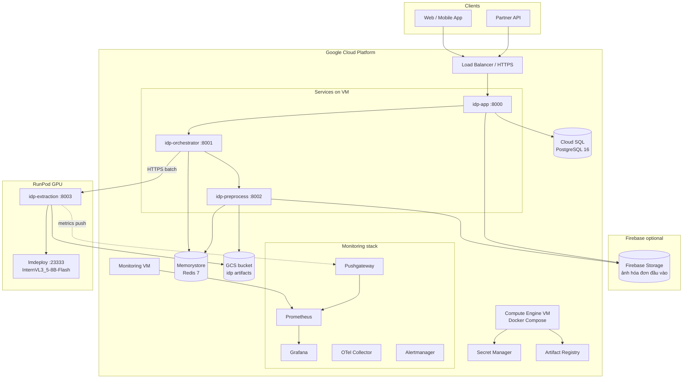

# Hạ tầng cần có — Nexts IDP Service

Tài liệu tổng hợp **toàn bộ hạ tầng** (infrastructure) cho hệ thống trích xuất hóa đơn IDP: production trên GCP + RunPod, môi trường local, monitoring, storage và bảo mật.

**Tài liệu liên quan:**

| Tài liệu | Nội dung |
|----------|----------|
| [deploy-production.md](deploy-production.md) | Quy trình triển khai từng bước |
| [architecture.md](architecture.md) | Kiến trúc logic & services |
| [image-sources.md](image-sources.md) | Firebase / GCS / HTTP cho ảnh đầu vào |
| [source-code-structure.md](source-code-structure.md) | Cấu trúc source code |

---

## 1. Sơ đồ hạ tầng production



---

## 2. Bảng thành phần hạ tầng

### 2.1 Production (bắt buộc)

| # | Thành phần | Công nghệ | Vai trò | Repo / path |
|---|------------|-----------|---------|-------------|
| 1 | **Compute (control plane)** | GCE VM + Docker | Chạy `idp-app`, `idp-orchestrator`, `idp-preprocess` | `deploy/terraform/gcp/modules/compute` |
| 2 | **Database** | Cloud SQL PostgreSQL 16 | Jobs, rules, prompts, kết quả, outbox webhook | `migrations/001_initial_schema.sql` |
| 3 | **Message queue / cache** | Memorystore Redis 7 | Redis Streams (preprocess tasks), batch state, circuit breaker | `packages/idp-common/.../redis_client.py` |
| 4 | **Object storage (artifacts)** | GCS | Ảnh normalized, mask fraud, blob trung gian | `deploy/terraform/gcp/modules/storage` |
| 5 | **GPU inference** | RunPod + lmdeploy | InternVL extraction, batch tối đa 48 | `deploy/runpod/` |
| 6 | **VPC / network** | GCP VPC, subnet | Cô lập VM, firewall | `modules/network` |
| 7 | **IAM** | Service Accounts | Quyền GCS, Secret, Cloud SQL | `modules/iam` |
| 8 | **Secrets** | Secret Manager | DB URL, RunPod key, HMAC callback | `modules/secrets` |
| 9 | **Container registry** | Artifact Registry | Image Docker 4 services | (triển khai ngoài Terraform hiện tại) |
| 10 | **Monitoring** | Prometheus + Grafana + Alertmanager | Metric, dashboard, alert | `infra/monitoring/` |

### 2.2 Production (khuyến nghị)

| Thành phần | Mục đích |
|------------|----------|
| **HTTPS Load Balancer** | TLS, domain public cho `idp-app` |
| **Cloud SQL Auth Proxy** | Kết nối DB an toàn từ VM |
| **Cloud Logging / Trace** | Log tập trung (OTel export) |
| **Cloud SQL backup tự động** | PITR, retention 7–30 ngày |
| **Firebase Storage** (hoặc GCS riêng) | Bucket **ảnh đầu vào** từ app mobile/web |
| **Pushgateway** | Metric từ RunPod trước khi pod tắt |
| **Uptime checks** | Health `/health` app + orchestrator |

### 2.3 Local development (thay thế managed services)

| Production | Local | File |
|------------|-------|------|
| Cloud SQL | Postgres 16 container | `deploy/docker/docker-compose.yml` |
| Memorystore | Redis 7 container | idem |
| GCS artifacts | MinIO | idem |
| RunPod GPU | `MOCK_MODE=true` trên `idp-extraction` | idem |
| Firebase input | HTTPS URL hoặc SA + bucket dev | [image-sources.md](image-sources.md) |
| Prometheus/Grafana | Containers trong compose | idem |

---

## 3. GCP — chi tiết từng module Terraform

Path: [`deploy/terraform/gcp/`](../deploy/terraform/gcp/)

| Module | Tạo ra | Ghi chú production |
|--------|--------|-------------------|
| **network** | VPC, subnet `10.0.0.0/24` | Gắn Cloud SQL private IP (nên bổ sung) |
| **storage** | Bucket `idp-{env}-artifacts` | Lifecycle xóa sau 90 ngày; CMEK tùy chọn |
| **database** | Cloud SQL Postgres 16, DB `idp` | Prod: HA, tier ≥ `db-custom-2-7680`, đổi password → Secret Manager |
| **cache** | Memorystore Redis 7 BASIC | Prod: cân nhắc STANDARD_HA, 2GB+ |
| **iam** | SA: app, preprocess, orchestrator | Preprocess: `objectAdmin` artifacts; đọc bucket Firebase nếu khác bucket |
| **compute** | VM `e2-standard-4` (mặc định) | Chạy Docker Compose; gắn SA app |
| **secrets** | Shell Secret Manager | `database-url`, `runpod-api-key`, `callback-hmac` |
| **observability** | VM monitoring + uptime alert | Prometheus/Grafana docker trên VM riêng |

### 3.1 Biến Terraform gợi ý

| Môi trường | `db_tier` | `redis_memory_gb` | `vm_machine_type` |
|------------|-----------|-------------------|-------------------|
| **dev** | `db-f1-micro` | 1 | `e2-standard-2` |
| **staging** | `db-custom-1-3840` | 1 | `e2-standard-4` |
| **prod** | `db-custom-2-7680`+ | 2–4 | `e2-standard-4`–`8` |

Region khuyến nghị: **`asia-southeast1`** (Singapore, gần VN).

---

## 4. RunPod — GPU extraction

| Hạng mục | Giá trị |
|----------|---------|
| **GPU** | NVIDIA A100 80GB (batch 48, ~472 tok/s — [baseline.json](performance/baseline.json)) |
| **Model** | `OpenGVLab/InternVL3_5-8B-Flash` |
| **Runtime** | lmdeploy API `:23333` + `idp-extraction` `:8003` |
| **Template** | [deploy/runpod/pod-template.json](../deploy/runpod/pod-template.json) |
| **Chiến lược chi phí** | Scale-to-zero khi idle; warm trước giờ cao điểm |

**Orchestrator cấu hình:**

```bash
EXTRACTION_URL=https://<runpod-host>:8003   # base URL, path /v1/batch/extract
BATCH_MAX_SIZE=48
BATCH_MAX_WAIT_MS=500
```

Runbook cold start: [runbooks/runpod-cold-start.md](runbooks/runpod-cold-start.md)

---

## 5. Storage — hai loại bucket

| Loại | Ví dụ bucket | Ai ghi/đọc | Nội dung |
|------|--------------|------------|----------|
| **Ảnh đầu vào** | Firebase default: `{project}.appspot.com` | App upload; preprocess **đọc** | Hóa đơn gốc từ user |
| **Artifact IDP** | `idp-prod-artifacts` (Terraform) | preprocess **ghi**; extraction **đọc** | `jobs/{id}/original.jpg`, `normalized.jpg`, `fraud_mask.png` |

Định dạng URL job: [image-sources.md](image-sources.md)

**Quyền SA preprocess:**

- `objectViewer` (hoặc hẹp hơn) trên bucket Firebase **đầu vào**
- `objectAdmin` trên bucket **artifact** IDP

---

## 6. Mạng và firewall

### 6.1 Luồng traffic

| From | To | Port | Giao thức |
|------|-----|------|-----------|
| Internet | Load Balancer | 443 | HTTPS → idp-app:8000 |
| idp-app | idp-orchestrator | 8001 | HTTP nội bộ Docker network |
| idp-orchestrator | idp-preprocess | (Redis) 6379 | Redis Streams |
| idp-orchestrator | RunPod extraction | 8003 | HTTPS |
| idp-orchestrator | idp-app | 8000 | HTTP webhook complete |
| idp-extraction (RunPod) | GCS | 443 | HTTPS Google API |
| idp-preprocess | GCS / Firebase | 443 | HTTPS |
| Prometheus | Services | 8000–8003 | `/metrics` |
| DevOps | Grafana | 3000 | HTTPS (IAP/VPN) |

### 6.2 Firewall gợi ý (prod)

- **Public:** chỉ LB (443) — không mở trực tiếp 8001/8002
- **RunPod:** allowlist IP egress của orchestrator VM
- **Redis / Cloud SQL:** private IP only, không public

Terraform hiện tại mở `8000–8002, 3000, 9090` trên VM — **thu hẹp trước khi prod**.

---

## 7. IAM & Service Accounts

| Service Account | Gắn vào | Quyền tối thiểu |
|-----------------|---------|-----------------|
| `idp-{env}-app` | VM app / idp-app container | Cloud SQL Client, Secret Accessor |
| `idp-{env}-preprocess` | idp-preprocess | GCS objectAdmin (artifacts), objectViewer (Firebase input bucket) |
| `idp-{env}-orch` | idp-orchestrator | GCS objectViewer (nếu cần), gọi HTTPS ra RunPod |
| RunPod / extraction | Pod GPU | GCS objectViewer (artifacts bucket) |

Credentials: JSON key hoặc Workload Identity; biến `GOOGLE_APPLICATION_CREDENTIALS`.

---

## 8. Secrets (Secret Manager)

| Secret | Consumer | Mô tả |
|--------|----------|-------|
| `idp-{env}-database-url` | idp-app | `postgresql+asyncpg://...` |
| `idp-{env}-callback-hmac-secret` | idp-app | Ký webhook khách hàng |
| `idp-{env}-runpod-api-key` | orchestrator (optional) | Tự động start pod |
| Firebase/GCP SA JSON | preprocess | Mount file, không commit git |

---

## 9. Monitoring & observability

Stack trong repo: [`infra/monitoring/`](../infra/monitoring/)

| Component | Port (local) | Chức năng |
|-----------|--------------|-----------|
| **Prometheus** | 9090 | Scrape `idp_*` metrics từ 4 services |
| **Grafana** | 3000 | Dashboard pipeline, batch/GPU |
| **Alertmanager** | 9093 | Route alert Slack/email |
| **OTel Collector** | 4317 | Trace/log export |
| **Pushgateway** | 9091 | Metric ephemeral RunPod |

**Metric quan trọng:** `idp_batch_utilization_ratio`, `idp_extraction_tokens_per_second`, `idp_circuit_breaker_state`, `idp_fraud_detected_total`.

**Alert rules:** `infra/monitoring/prometheus/rules/idp_recording.yml`

**GCP native (bổ sung):** Cloud Monitoring alert VM disk, Redis memory, SQL connections.

---

## 10. Artifact & model cần lưu trữ

| Artifact | Kích thước ước lượng | Vị trí |
|----------|---------------------|--------|
| DocTamper `mit_unet_doctamper_best.pt` | ~100–500 MB | GCS hoặc mount VM preprocess |
| InternVL3_5-8B-Flash | ~16 GB+ | RunPod volume / HF cache |
| Docker images (4 services) | ~2–8 GB tổng | Artifact Registry |
| DB | Tăng theo job | Cloud SQL disk |

---

## 11. CI/CD

| Thành phần | Path | Việc làm |
|------------|------|----------|
| GitHub Actions | `.github/workflows/ci.yml` | pytest, baseline compare |
| Build image | Manual / pipeline | `docker build` + push AR |
| DB migration | `migrations/` | Chạy khi deploy version mới |
| Load test | `scripts/perf/k6_create_jobs.js` | Staging / nightly |

---

## 12. So sánh nhanh: Local vs Staging vs Production

| Hạng mục | Local | Staging | Production |
|----------|-------|---------|------------|
| Compute | Docker Compose | 1× GCE VM | 1–2× GCE VM (HA tùy chọn) |
| PostgreSQL | Container | Cloud SQL nhỏ | Cloud SQL HA |
| Redis | Container | Memorystore 1GB | Memorystore 2GB+ |
| Artifacts | MinIO | GCS | GCS + lifecycle |
| Ảnh đầu vào | HTTP / Firebase dev | Firebase staging bucket | Firebase prod bucket |
| Extraction | Mock | RunPod (spot/A100) | RunPod A100, scale-to-zero |
| TLS | Không | Có (staging domain) | LB + cert managed |
| Monitoring | Compose stack | Đầy đủ | Đầy đủ + on-call |
| Backup DB | Không | 7 ngày | 30 ngày + PITR |

---

## 13. Checklist hạ tầng trước go-live

### GCP core
- [ ] VPC + subnet
- [ ] Cloud SQL Postgres (migration + seed)
- [ ] Memorystore Redis
- [ ] GCS bucket artifacts + IAM
- [ ] VM app + Docker Compose prod
- [ ] Secret Manager populated
- [ ] Artifact Registry + images tagged `prod`

### Firebase / storage đầu vào
- [ ] Bucket Firebase/GCS cho ảnh hóa đơn
- [ ] SA preprocess có quyền đọc
- [ ] `FIREBASE_ALLOWED_BUCKETS` cấu hình

### RunPod
- [ ] Pod template + lmdeploy healthy
- [ ] `idp-extraction` `MOCK_MODE=false`
- [ ] `EXTRACTION_URL` orchestrator trỏ đúng
- [ ] Firewall / allowlist IP

### Monitoring & vận hành
- [ ] Prometheus scrape all targets UP
- [ ] Grafana dashboard import
- [ ] Alertmanager notification channel
- [ ] Runbook cold start + throughput degraded
- [ ] `./scripts/smoke_e2e.sh` pass trên staging

### Bảo mật
- [ ] Không public Redis/SQL
- [ ] `CALLBACK_HMAC_SECRET` production-grade
- [ ] Thu hẹp firewall VM (chỉ LB)
- [ ] Backup & restore DB đã test

---

## 14. Ước lượng tài nguyên tối thiểu (production nhỏ)

| Resource | Spec tối thiểu |
|----------|----------------|
| GCE VM (3 services) | 4 vCPU, 16 GB RAM |
| Cloud SQL | 2 vCPU, 7.5 GB RAM, 50 GB SSD |
| Redis | 1 GB (2 GB khuyến nghị) |
| GCS | Pay per use; ~vài GB/tháng tùy volume ảnh |
| RunPod A100 80GB | Theo giờ chạy GPU (chi phí lớn nhất khi bật) |
| Monitoring VM | 2 vCPU, 8 GB RAM |

Throughput mục tiêu (RunPod warm, BS=48): ~2 req/s extraction, ~472 tok/s — tham chiếu [performance/baseline.json](performance/baseline.json).

---

## 15. IaC & thư mục deploy trong repo

```text
deploy/
├── docker/
│   └── docker-compose.yml      # Local / dev full stack
├── terraform/gcp/
│   ├── main.tf
│   ├── variables.tf
│   └── modules/
│       ├── network/
│       ├── storage/
│       ├── database/
│       ├── cache/
│       ├── iam/
│       ├── compute/
│       ├── secrets/
│       └── observability/
└── runpod/
    ├── pod-template.json
    └── start_lmdeploy.sh

infra/monitoring/               # Prometheus, Grafana, OTel, alerts
migrations/                       # PostgreSQL schema
```

---

*Tài liệu tổng hợp hạ tầng cho Nexts IDP — cập nhật khi thêm region, HA, hoặc thay RunPod bằng GKE GPU.*
