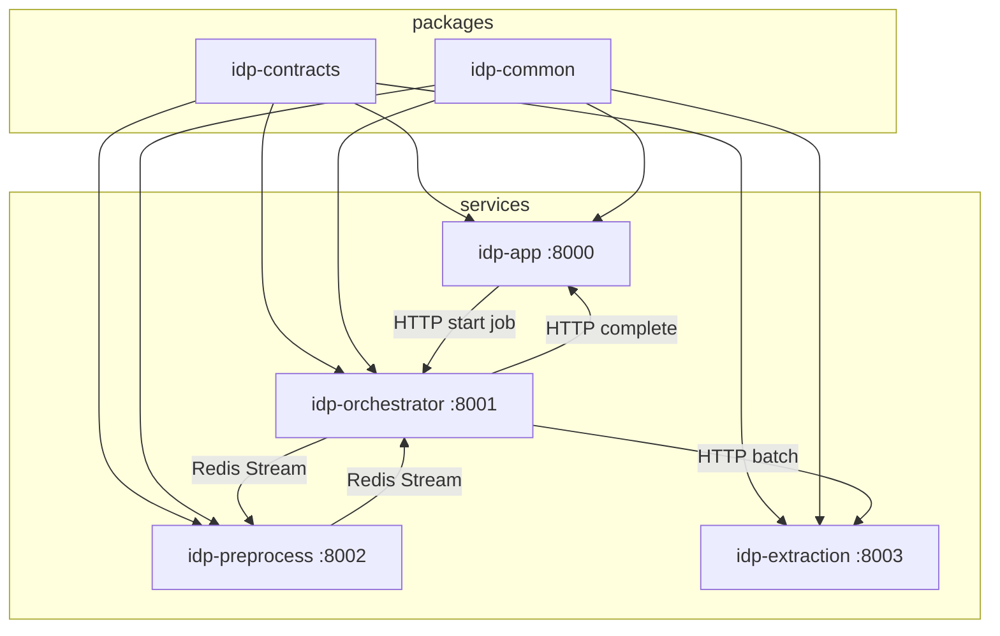

# Tài liệu cấu trúc source code — Nexts IDP Service

Tài liệu mô tả chi tiết cây thư mục, package, module và luồng code hiện tại trong repository `nexts-system-idp-service`.

**Liên quan:** [architecture.md](architecture.md) · [deploy-production.md](deploy-production.md) · [api/README.md](api/README.md)

---

## 1. Tổng quan kiến trúc code

Hệ thống là **monorepo Python** gồm:

- **2 shared packages** (`idp-contracts`, `idp-common`) — dùng chung bởi 4 microservice
- **4 FastAPI services** — mỗi service có `src/`, `Dockerfile`, `pyproject.toml`, `tests/`
- **Hạ tầng & deploy** — Docker Compose, Terraform GCP, RunPod, monitoring
- **Tham chiếu nghiên cứu** — notebook Colab export trong `references/` (không chạy production)



---

## 2. Cây thư mục đầy đủ

```text
nexts-system-idp-service/
├── pyproject.toml                 # Workspace root (uv/ruff)
├── README.md
│
├── packages/                      # Thư viện dùng chung
│   ├── idp-contracts/
│   │   ├── pyproject.toml
│   │   ├── openapi/
│   │   │   └── idp-app.openapi.yaml
│   │   └── src/idp_contracts/
│   │       ├── __init__.py
│   │       ├── enums.py
│   │       ├── jobs.py
│   │       ├── prompts.py
│   │       └── rules.py
│   └── idp-common/
│       ├── pyproject.toml
│       └── src/idp_common/
│           ├── __init__.py
│           ├── config.py
│           ├── logging.py
│           ├── metrics.py
│           ├── tracing.py
│           ├── redis_client.py
│           ├── gcs.py
│           └── health.py
│
├── services/                      # Microservices triển khai
│   ├── idp-app/
│   ├── idp-orchestrator/
│   ├── idp-preprocess/
│   └── idp-extraction/
│
├── migrations/
│   └── 001_initial_schema.sql     # PostgreSQL schema
│
├── scripts/
│   ├── seed_prompts.sql
│   ├── smoke_e2e.sh
│   └── perf/
│
├── deploy/
│   ├── docker/docker-compose.yml
│   ├── terraform/gcp/
│   └── runpod/
│
├── infra/monitoring/              # Prometheus, Grafana, OTel, alerts
├── docs/                          # Tài liệu
├── references/                    # Notebook tham khảo (Colab)
└── .github/workflows/ci.yml
```

---

## 3. Workspace root

| File | Mục đích |
|------|----------|
| `pyproject.toml` | Khai báo uv workspace members (4 services + 2 packages), cấu hình Ruff |
| `README.md` | Quick start local, link tài liệu |

Các service **không** cài chéo bằng editable install từ root; Docker build copy `packages/` + `services/` và `uv pip install -e`.

---

## 4. Package: `idp-contracts`

**Đường dẫn:** `packages/idp-contracts/`  
**Import:** `from idp_contracts import ...`  
**Vai trò:** Hợp đồng dữ liệu (Pydantic v2) và enum dùng xuyên suốt HTTP API, Redis message, webhook nội bộ.

### 4.1 Module `enums.py`

| Enum | Giá trị quan trọng |
|------|-------------------|
| `JobStatus` | Vòng đời job: `PENDING` → … → `COMPLETED` / `FRAUD_DETECTED` / `FAILED` |
| `JobStage` | Tên stage cho metric: `download`, `fraud`, `extract`, … |
| `CircuitBreakerState` | `CLOSED`, `OPEN`, `HALF_OPEN` (orchestrator → RunPod) |

### 4.2 Module `jobs.py`

| Model | Dùng ở đâu |
|-------|------------|
| `CreateJobRequest` / `CreateJobResponse` | API public `POST /v1/jobs` |
| `JobDetailResponse` | API `GET /v1/jobs/{id}` |
| `PreprocessTaskMessage` | Redis `preprocess.tasks` (orchestrator → preprocess) |
| `PreprocessResultMessage` | Redis `preprocess.results` (preprocess → orchestrator) |
| `FraudResult` | Kết quả DocTamper |
| `BatchExtractionRequest` / `BatchExtractionResponse` | HTTP orchestrator → extraction |
| `JobCompletionWebhook` | HTTP orchestrator → app `POST /internal/v1/jobs/complete` |

### 4.3 Module `rules.py` / `prompts.py`

- CRUD DTO cho `POST /v1/rules`, `POST /v1/prompt-profiles`
- Map 1:1 với bảng PostgreSQL `rules`, `prompt_profiles`

### 4.4 OpenAPI

`openapi/idp-app.openapi.yaml` — skeleton OpenAPI 3.1 (chưa generate client tự động).

---

## 5. Package: `idp-common`

**Đường dẫn:** `packages/idp-common/`  
**Import:** `from idp_common import ...`  
**Vai trò:** Hạ tầng kỹ thuật dùng lại (config, log, metric, Redis, GCS, health).

### 5.1 `config.py` — `BaseServiceSettings`

Lớp cơ sở Pydantic Settings; mỗi service kế thừa và thêm field riêng.

| Biến môi trường (gợi ý) | Mặc định | Ý nghĩa |
|-------------------------|----------|---------|
| `SERVICE_NAME` | `idp` | Tên service cho log/metric |
| `ENV` | `dev` | Label Prometheus |
| `REDIS_URL` | `redis://localhost:6379/0` | Redis Streams |
| `DATABASE_URL` | Postgres local | Chỉ app dùng trực tiếp |
| `GCS_BUCKET` | `idp-artifacts-dev` | Bucket artifact |
| `GCS_EMULATOR_HOST` | `None` | Set `http://minio:9000` khi local |
| `OTEL_EXPORTER_ENDPOINT` | `None` | OTLP gRPC collector |

### 5.2 `redis_client.py` — `RedisStreams`

Abstraction **Redis Streams** + consumer groups:

| Hằng số | Stream / Group |
|---------|----------------|
| `PREPROCESS_TASKS` | Stream task preprocess |
| `PREPROCESS_RESULTS` | Stream kết quả preprocess |
| `PREPROCESS_GROUP` | Consumer group worker preprocess |
| `ORCHESTRATOR_GROUP` | Consumer group orchestrator đọc results |

Methods: `publish`, `read_group`, `ack`, `get_stream_lag`, `set_key`/`get_key` (cache prompt theo `job_id`).

### 5.3 `gcs.py` — `GCSClient`

- Upload bytes/file → URI `gs://bucket/path`
- Download từ `gs://` URI
- Hỗ trợ `STORAGE_EMULATOR_HOST` cho MinIO local

### 5.3b `storage_uri.py` + `image_fetcher.py` — Nguồn ảnh đầu vào

- **`parse_image_reference`**: HTTP, `gs://`, `firebase://`, URL `firebasestorage.googleapis.com`
- **`ImageFetcher`**: tải bytes (GCS API cho Firebase/GCS; httpx cho HTTP)
- Xem [image-sources.md](image-sources.md)

### 5.4 `metrics.py` — `MetricsRegistry`

Prometheus metrics chuẩn IDP (prefix `idp_*`): jobs, stage duration, batch size/utilization, extraction tokens/s, fraud, circuit breaker, callbacks, v.v.

### 5.5 `health.py`

FastAPI router:

- `GET /health` → `{"status": "ok"}`
- `GET /metrics` → Prometheus text format

Mọi service `app.include_router(health_router)`.

### 5.6 `logging.py` / `tracing.py`

- Structlog JSON logging
- OpenTelemetry `TracerProvider` + OTLP export (optional)

---

## 6. Service: `idp-app` (port 8000)

**Vai trò:** API công khai, PostgreSQL, rules engine, webhook khách hàng.

```text
services/idp-app/
├── Dockerfile
├── pyproject.toml
├── .env.example
├── src/idp_app/
│   ├── main.py              # FastAPI routes
│   ├── config.py            # Settings (orchestrator URL, HMAC secret)
│   ├── repository.py        # DB CRUD
│   ├── rules_engine.py      # JSON Logic subset
│   ├── callbacks.py         # Outbox + HMAC delivery
│   └── db/
│       ├── models.py        # SQLAlchemy ORM
│       └── session.py       # Async engine + get_db
└── tests/
```

### 6.1 Luồng chính (`main.py`)

1. **`POST /v1/jobs`**  
   - `repository.create_job` (idempotency qua header)  
   - Load `prompt_profile` nếu có  
   - `httpx.post` → orchestrator `/internal/v1/jobs/start`

2. **`GET /v1/jobs/{job_id}`**  
   - Trả status + fraud + extraction + rules từ ORM

3. **`POST /internal/v1/jobs/complete`** (nội bộ)  
   - Lưu `fraud_results`, `extraction_results`  
   - `apply_rules` từ DB `rules`  
   - `save_job_result`, cập nhật `jobs.status`  
   - `enqueue_callback` nếu có `callback_url`

4. **`POST /v1/rules`**, **`POST /v1/prompt-profiles`** — CRUD cấu hình động

5. **Background:** `_callback_loop` mỗi 5s gửi `outbox_callbacks` pending

### 6.2 `rules_engine.py`

Engine JSON Logic **tối giản** (không phụ thuộc thư viện ngoài): `==`, `var`, `missing`, `and`, `or`, `!`.  
Rule trong DB có `condition_json` + `action_json` (thường `{"set": {...}}`).

### 6.3 `db/models.py`

| Model | Bảng SQL |
|-------|----------|
| `Job` | `jobs` |
| `PromptProfile` | `prompt_profiles` |
| `Rule` | `rules` |
| `FraudResult` | `fraud_results` |
| `ExtractionResult` | `extraction_results` |
| `JobResult` | `job_results` |
| `OutboxCallback` | `outbox_callbacks` |

Quan hệ 1:1 job ↔ fraud/extraction/job_result.

---

## 7. Service: `idp-orchestrator` (port 8001)

**Vai trò:** Điều phối pipeline, gom batch, circuit breaker, gọi extraction và app.

```text
services/idp-orchestrator/
├── src/idp_orchestrator/
│   ├── main.py                 # HTTP internal API
│   ├── orchestrator.py         # OrchestratorService — core loop
│   ├── batch_accumulator.py    # Micro-batching (max 48)
│   ├── circuit_breaker.py      # Trạng thái OPEN/CLOSED
│   └── config.py
└── tests/test_batch_accumulator.py
```

### 7.1 `OrchestratorService` (`orchestrator.py`)

Hai vòng lặp asyncio song song:

| Loop | Chức năng |
|------|-----------|
| `run_forever` | Đọc `preprocess.results` → `_handle_preprocess` |
| `_batch_loop` | `accumulator.wait_and_flush()` → `_send_batch` |

**`_handle_preprocess`:**

- `FRAUD_DETECTED` → webhook app ngay (short-circuit, không gọi GPU)
- `READY` → `accumulator.add(PendingJob)` với GCS URI + prompt từ Redis

**`_send_batch`:**

- `POST {EXTRACTION_URL}/v1/batch/extract`
- Thành công → từng job `EXTRACTED` → webhook app
- Lỗi → `circuit.record_failure()`, jobs `EXTRACTION_FAILED`

### 7.2 `BatchAccumulator`

- `BATCH_MAX_SIZE` (default 48), `BATCH_MAX_WAIT_MS` (default 500)
- Flush khi đủ size **hoặc** hết thời gian chờ
- `to_batch_request()` → `BatchExtractionRequest`

### 7.3 HTTP API (`main.py`)

| Endpoint | Mô tả |
|----------|--------|
| `POST /internal/v1/jobs/start` | App gọi: publish preprocess task + lưu prompt/schema Redis |
| `POST /internal/runpod/warm` | Set flag Redis `idp:runpod:warm` + metric |

---

## 8. Service: `idp-preprocess` (port 8002)

**Vai trò:** Tải ảnh từ URL, chuẩn hóa, DocTamper fraud, upload GCS.

```text
services/idp-preprocess/
├── src/idp_preprocess/
│   ├── main.py                 # Lifespan + worker task
│   ├── worker.py               # PreprocessWorker — Redis consumer
│   ├── downloader.py           # httpx parallel download
│   ├── config.py
│   └── models/
│       └── doctamper.py        # MiT-B2 + U-Net (smp)
└── tests/test_doctamper_mock.py
```

### 8.1 `PreprocessWorker.process_task`

1. `ImageDownloader.download_all(image_urls)`
2. `normalize_image` (EXIF, resize max edge)
3. Upload `jobs/{job_id}/original.jpg`, `normalized.jpg`
4. Nếu `fraud_enabled`: `DocTamperModel.infer_bytes` → mask PNG nếu tampered
5. Publish `PreprocessResultMessage` lên `preprocess.results`

### 8.2 `DocTamperModel`

Port logic từ `references/doctamper_mix_transformer_unet_real_receipt.py`:

- Encoder `mit_b2`, U-Net 2 lớp, threshold `tamper_ratio`
- Không có checkpoint → `is_loaded` false → **mock** (không fraud)
- AMP float16 trên CUDA

### 8.3 `downloader.py` + `ImageFetcher` (idp-common)

- Worker dùng **`ImageFetcher.fetch_all`** (không còn chặn `gs://`)
- Hỗ trợ Firebase Storage, GCS, HTTP — xem [image-sources.md](image-sources.md)
- `normalize_image()` vẫn trong `downloader.py`

---

## 9. Service: `idp-extraction` (port 8003)

**Vai trò:** Batch inference VLM, parse JSON, chuẩn hóa hóa đơn VN, validate schema; production chạy cạnh lmdeploy trên RunPod.

Chi tiết: [extraction-pipeline.md](extraction-pipeline.md) · Reference: `references/internlm_invoice_pipeline*.py`

```text
services/idp-extraction/
├── src/idp_extraction/
│   ├── main.py                 # POST /v1/batch/extract
│   ├── lmdeploy_client.py      # OpenAI-compatible + system/user messages
│   ├── prompts.py              # base | reasoning | reasoning_vir
│   ├── invoice_schema.py       # INVOICE_JSON_SCHEMA
│   ├── invoice_normalize.py    # canonicalize + line_amount rules
│   ├── schema_validator.py     # JSON parse + VN numeric literals
│   ├── push_metrics.py
│   └── config.py
└── tests/
```

### 9.1 `batch_extract` (`main.py`)

Với mỗi item trong batch:

1. `GCSClient.download_to_bytes(gcs_uri)`
2. `LmdeployClient.extract_one` (mock hoặc gọi `/v1/chat/completions`)
3. `validate_against_schema` nếu có `response_schema`
4. Ghi metric tokens, batch size, TPS

### 9.2 `LmdeployClient`

| `MOCK_MODE` | Hành vi |
|-------------|---------|
| `true` | Trả JSON hóa đơn mẫu (`_mock: true`) |
| `false` | POST multimodal (text + image base64) tới lmdeploy |

### 9.3 `schema_validator.py`

- `extract_json_from_text` — parse JSON từ markdown/text model
- `validate_against_schema` — Draft7 jsonschema

---

## 10. Luồng dữ liệu end-to-end (code path)

```text
[Client]
   POST /v1/jobs
      idp_app/main.py::create_job_endpoint
      idp_app/repository.py::create_job
      HTTP → idp_orchestrator/main.py::start_job
      idp_orchestrator/orchestrator.py::start_job
         Redis XADD preprocess.tasks

      idp_preprocess/worker.py::run_forever
         process_task → GCS upload
         Redis XADD preprocess.results

      idp_orchestrator/orchestrator.py::_handle_preprocess
         batch_accumulator.add OR _complete_job (fraud)

      idp_orchestrator/orchestrator.py::_send_batch
         HTTP → idp_extraction/main.py::batch_extract
         lmdeploy_client + schema_validator

      idp_orchestrator/orchestrator.py::_complete_job
         HTTP → idp_app/main.py::job_complete
         rules_engine + repository + callbacks

[Client]
   GET /v1/jobs/{id}
```

---

## 11. PostgreSQL (`migrations/`)

| Bảng | Ghi chú |
|------|---------|
| `jobs` | Trạng thái chính, `image_urls` JSONB |
| `job_stages` | Audit từng stage (schema có, app chưa ghi đầy đủ) |
| `job_artifacts` | URI GCS (schema có, có thể mở rộng) |
| `fraud_results` | 1:1 với job |
| `extraction_results` | raw + validated JSON |
| `job_results` | Kết quả sau rules |
| `prompt_profiles` | Prompt + JSON schema extraction |
| `rules` | JSON Logic rules theo tenant |
| `outbox_callbacks` | Reliable webhook |

Seed: `scripts/seed_prompts.sql` — prompt receipt mặc định + 2 rules mẫu.

---

## 12. Deploy & Infra (không phải Python app logic)

### 12.1 `deploy/docker/`

`docker-compose.yml` — stack local đầy đủ: Postgres, Redis, MinIO, 4 services, Prometheus, Grafana, OTel, Alertmanager, Pushgateway.

### 12.2 `deploy/terraform/gcp/`

Modules: `network`, `storage`, `database`, `cache`, `iam`, `compute`, `secrets`, `observability`.

### 12.3 `deploy/runpod/`

- `pod-template.json` — GPU A100, InternVL env
- `start_lmdeploy.sh` — khởi động API server lmdeploy

### 12.4 `infra/monitoring/`

Cấu hình Prometheus scrape, recording rules, Grafana dashboard JSON, Alertmanager, OTel collector.

---

## 13. Scripts & CI

| Path | Mục đích |
|------|----------|
| `scripts/smoke_e2e.sh` | Health + tạo job + poll status |
| `scripts/perf/k6_create_jobs.js` | Load test k6 |
| `scripts/perf/baseline_compare.py` | So sánh tok/s với `docs/performance/baseline.json` |
| `.github/workflows/ci.yml` | pytest 4 services + baseline check |

---

## 14. `references/` (không import production)

| File | Nội dung |
|------|----------|
| `doctamper_mix_transformer_unet_real_receipt.py` | Notebook inference DocTamper → tham chiếu port sang `doctamper.py` |
| `intern_vl3_6_8b_metric.py` | Benchmark batch size InternVL → `docs/performance/baseline.json` |

---

## 15. Phụ thuộc giữa các module

```text
idp-contracts  (no internal deps)

idp-common  →  idp-contracts (optional trong types), pydantic-settings, redis, prometheus, opentelemetry, google-cloud-storage

idp-app  →  idp-contracts, idp-common, fastapi, sqlalchemy, asyncpg

idp-orchestrator  →  idp-contracts, idp-common, fastapi, httpx

idp-preprocess  →  idp-contracts, idp-common, torch, segmentation-models-pytorch, pillow, httpx

idp-extraction  →  idp-contracts, idp-common, jsonschema, httpx
```

---

## 16. Cấu hình theo service (file `.env.example`)

| Service | File |
|---------|------|
| idp-app | `services/idp-app/.env.example` |
| idp-orchestrator | `services/idp-orchestrator/.env.example` |
| idp-preprocess | `services/idp-preprocess/.env.example` |
| idp-extraction | `services/idp-extraction/src/idp_extraction/config.py` (field defaults) |

---

## 17. Điểm mở rộng trong code (gợi ý)

| Khu vực | Hiện trạng | Hướng mở rộng |
|---------|------------|---------------|
| `job_stages` | Schema có, ít ghi | Ghi stage trong worker/orchestrator |
| `job_artifacts` | Schema có | Persist URI sau preprocess |
| S3 `s3://` | Chưa hỗ trợ | Adapter tương tự `ImageFetcher` |
| Rules engine | Subset JSON Logic | Thêm toán tử hoặc tích hợp thư viện đầy đủ |
| Auth API | Chưa có | API key / JWT middleware trên `idp-app` |
| Horizontal scale | 1 consumer name cố định | Nhiều `consumer_name` preprocess/orchestrator |

---

## 18. Bản đồ file → trách nhiệm (tra cứu nhanh)

| Cần sửa… | Mở file |
|----------|---------|
| API tạo job / callback | `services/idp-app/src/idp_app/main.py` |
| Rule nghiệp vụ | `rules_engine.py` + DB `rules` |
| Batch size / wait | `services/idp-orchestrator/src/idp_orchestrator/config.py` |
| Circuit breaker | `circuit_breaker.py`, `orchestrator.py` |
| Fraud threshold / model | `idp_preprocess/config.py`, `models/doctamper.py` |
| Prompt extraction | DB `prompt_profiles`, `seed_prompts.sql` |
| VLM / mock extraction | `idp_extraction/config.py`, `lmdeploy_client.py` |
| DTO message Redis/HTTP | `packages/idp-contracts/src/idp_contracts/jobs.py` |
| Metric mới | `packages/idp-common/src/idp_common/metrics.py` |
| Redis stream name | `packages/idp-common/src/idp_common/redis_client.py` |
| DB schema | `migrations/001_initial_schema.sql` |

---

*Tài liệu phản ánh cấu trúc repo tại thời điểm implement plan IDP production. Cập nhật khi thêm service hoặc đổi contract.*
